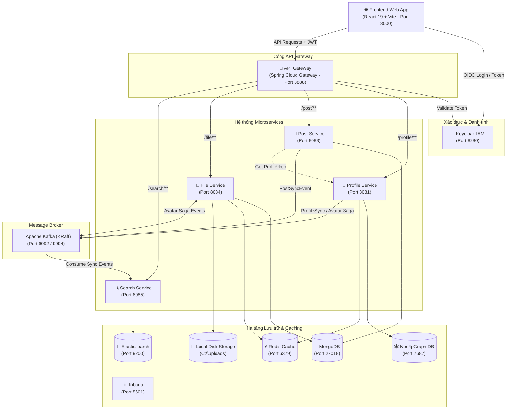

# Markie — Distributed Social Network Platform

**Markie** là nền tảng mạng xã hội hiện đại được xây dựng theo kiến trúc **Microservices hướng sự kiện (Event-Driven Microservices Architecture)**, kết hợp đa dạng các hệ cơ sở dữ liệu (**Polyglot Persistence**) nhằm tối ưu hóa hiệu năng, khả năng mở rộng và trải nghiệm người dùng.

---

## 📑 Mục lục
- [Kiến trúc hệ thống (System Architecture)](#-kiến-trúc-hệ-thống)
- [Công nghệ & Thành phần (Tech Stack)](#-công-nghệ--thành-phần)
- [Bản đồ Cổng & Dịch vụ (Ports & Services)](#-bản-đồ-cổng--dịch-vụ)
- [Các Pattern kiến trúc nổi bật](#-các-pattern-kiến-trúc-nổi-bật)
- [Yêu cầu môi trường (Prerequisites)](#-yêu-cầu-môi-trường)
- [Hướng dẫn cài đặt & Khởi chạy (Getting Started)](#-hướng-dẫn-cài-đặt--khởi-chạy)
  - [Bước 1: Khởi động Hạ tầng Docker (Infrastructure)](#bước-1-khởi-động-hạ-tầng-docker)
  - [Bước 2: Cấu hình Identity Provider (Keycloak)](#bước-2-cấu-hình-identity-provider-keycloak)
  - [Bước 3: Khởi chạy các Backend Microservices](#bước-3-khởi-chạy-các-backend-microservices)
  - [Bước 4: Khởi chạy Frontend Web App](#bước-4-khởi-chạy-frontend-web-app)
- [Dữ liệu mẫu & Kiểm thử tìm kiếm](#-dữ-liệu-mẫu--kiểm-thử-tìm-kiếm)
- [Cấu trúc thư mục dự án](#-cấu-trúc-thư-mục-dự-án)

---

## 🏛 Kiến trúc hệ thống

Dự án áp dụng mô hình Microservices với **Spring Cloud Gateway** làm cổng định tuyến duy nhất, xác thực tập trung qua **Keycloak (OIDC / OAuth2)**, và đồng bộ dữ liệu bất đồng bộ qua **Apache Kafka**.



---

## 🛠 Công nghệ & Thành phần

| Thành phần | Công nghệ chính | Ghi chú |
|---|---|---|
| **Frontend** | React 19, TypeScript, Vite, TailwindCSS v4, Framer Motion, Phosphor Icons | Single Page Application tương tác mượt mà |
| **Authentication** | Keycloak 24+, OpenID Connect (OIDC), OAuth2, JWT | SSO, cấp quyền, quản lý phiên đăng nhập |
| **API Gateway** | Spring Cloud Gateway (Java 21, Spring Boot 3.2.5), WebFlux | Routing, Rate limiting, Filter security |
| **Backend Services** | Spring Boot 3.2.5, Java 21 LTS | REST API, Spring Data, MapStruct, Lombok |
| **Message Broker** | Apache Kafka 3.7 (KRaft mode - không cần ZooKeeper) | Xử lý sự kiện phân tán, đồng bộ CQRS |
| **Graph Database** | Neo4j 5.x | Lưu trữ biểu đồ quan hệ người dùng (Friends, Followers) |
| **Document Database** | MongoDB | Lưu trữ bài viết, bình luận, lượt thích và file metadata |
| **Search Engine** | Elasticsearch 8.13.0 & Kibana 8.13.0 | Tìm kiếm toàn văn (Full-text search), gợi ý từ khóa |
| **Cache & In-Memory** | Redis 7 | Caching dữ liệu người dùng, phục vụ Saga transaction |

---

## 🔌 Bản đồ Cổng & Dịch vụ

| Dịch vụ | Loại | Port | Context Path | Vai trò |
|---|---|---|---|---|
| **Web App** | Frontend | `3000` | `/` | Giao diện người dùng web (React) |
| **API Gateway** | Backend | `8888` | `/` | Cổng API tập trung |
| **Profile Service** | Backend | `8081` | `/profile` | Quản lý hồ sơ người dùng, mối quan hệ xã hội |
| **Post Service** | Backend | `8083` | `/post` | Đăng bài viết, bình luận, tương tác Like |
| **File Service** | Backend | `8084` | `/file` | Tải lên, tải xuống và lưu trữ tệp tin |
| **Search Service** | Backend | `8085` | `/search` | Tìm kiếm bài viết, người dùng, hashtag |
| **Keycloak IAM** | Hạ tầng | `8280` | `/` | Identity Provider, cấp phát JWT |
| **Apache Kafka** | Broker | `9092` (Internal)<br>`9094` (External) | - | Message Broker phân tán |
| **Redis** | Cache | `6379` | - | Cache & in-memory temporary store |
| **Elasticsearch** | Search DB | `9200` | - | Lưu trữ chỉ mục tìm kiếm |
| **Kibana** | Dashboard | `5601` | - | Quản lý, truy vấn Elasticsearch trực quan |
| **MongoDB** | Database | `27018` | - | Lưu bài viết (`post-service`), file (`file-service`) |
| **Neo4j** | Graph DB | `7474` (HTTP)<br>`7687` (Bolt) | - | Cơ sở dữ liệu đồ thị cho quan hệ mạng xã hội |

---

## 💡 Các Pattern kiến trúc nổi bật

1. **Saga Choreography Pattern (Distributed Transaction)**:
   - Áp dụng khi người dùng thay đổi Avatar:
     1. `profile-service` lưu tạm ảnh vào Redis và bắn sự kiện `avatar.upload.requested`.
     2. `file-service` tiêu thụ sự kiện, lưu file vào ổ đĩa/MongoDB, rồi phát hành sự kiện `avatar.file.uploaded`.
     3. `profile-service` cập nhật URL avatar vào Neo4j. Nếu xảy ra lỗi, sự kiện bù trừ `avatar.profile.update.failed` sẽ được kích hoạt để `file-service` xóa file rác (`avatar.file.deleted`), đảm bảo dữ liệu luôn nhất quán.

2. **CQRS & Real-time Event Synchronization**:
   - Khi bài viết mới được đăng hoặc hồ sơ được cập nhật, `post-service` và `profile-service` phát hành sự kiện (`PostSyncEvent`, `ProfileSyncEvent`) lên Kafka.
   - `search-service` lắng nghe các sự kiện này và tự động lập chỉ mục vào Elasticsearch, tách biệt hoàn toàn tải đọc (Read / Search) khỏi tải ghi (Write / OLTP).

3. **Polyglot Persistence**:
   - Tận dụng thế mạnh của từng hệ CSDL: **Neo4j** cho đồ thị bạn bè nhiều tầng, **MongoDB** cho cấu trúc bài viết linh hoạt không cố định schema, **Redis** cho truy xuất tức thì, và **Elasticsearch** cho tìm kiếm tiếng Việt toàn văn và đề xuất nhanh.

---

## 📋 Yêu cầu môi trường

Để chạy dự án, máy tính cần cài đặt sẵn:
- **Java**: JDK 21 trở lên (khuyến nghị OpenJDK 21 hoặc Eclipse Temurin 21)
- **Node.js**: Phiên bản 20.x hoặc mới hơn & npm
- **Docker & Docker Compose**: Để chạy toàn bộ hạ tầng cơ sở dữ liệu và message broker
- **Maven**: 3.9+ (hoặc dùng sẵn script `./mvnw` đi kèm trong mỗi thư mục backend)

---

## 🚀 Hướng dẫn cài đặt & Khởi chạy

### Bước 1: Khởi động Hạ tầng Docker

File `docker-compose.yml` ở thư mục gốc đã cấu hình sẵn **Kafka, Redis, Elasticsearch và Kibana**.

1. Chạy cụm dịch vụ có sẵn trong `docker-compose.yml`:
   ```bash
   docker compose up -d
   ```

2. Khởi động thêm **MongoDB, Neo4j, và Keycloak**:
   - **MongoDB** (Port `27018`):
     ```bash
     docker run -d --name mongodb-markie \
       -p 27018:27017 \
       -e MONGO_INITDB_ROOT_USERNAME=root \
       -e MONGO_INITDB_ROOT_PASSWORD=root \
       mongo:latest
     ```

   - **Neo4j** (Port `7474`, `7687`):
     ```bash
     docker run -d --name neo4j-markie \
       -p 7474:7474 -p 7687:7687 \
       -e NEO4J_AUTH=neo4j/12345678 \
       neo4j:5-community
     ```

   - **Keycloak** (Port `8280`):
     ```bash
     docker run -d --name keycloak-markie \
       -p 8280:8080 \
       -e KEYCLOAK_ADMIN=admin \
       -e KEYCLOAK_ADMIN_PASSWORD=admin \
       quay.io/keycloak/keycloak:24.0.0 start-dev
     ```

---

### Bước 2: Cấu hình Identity Provider (Keycloak)

1. Truy cập trang quản trị Keycloak: [http://localhost:8280](http://localhost:8280)
2. Đăng nhập với tài khoản Admin (`admin` / `admin`).
3. Tạo Realm mới:
   - Nhấn **Create Realm** ➔ Đặt tên là `markie`.
4. Tạo Client cho Web App:
   - Vào mục **Clients** ➔ **Create client**.
   - **Client ID**: `markie_webapp`
   - **Client Protocol**: `openid-connect`
   - **Client Authentication**: `Off` (Public Client)
   - **Valid redirect URIs**: `http://localhost:3000/*`
   - **Valid post logout redirect URIs**: `http://localhost:3000/*`
   - **Web origins**: `*` hoặc `http://localhost:3000`
5. Bật đăng ký tự do (Tùy chọn):
   - Vào **Realm settings** ➔ Tab **Login** ➔ Bật **User registration** thành `ON`.

---

### Bước 3: Khởi chạy các Backend Microservices

Mở từng cửa sổ dòng lệnh (Terminal/PowerShell) cho mỗi service và chạy theo thứ tự khuyến nghị sau:

#### 1. API Gateway (Port 8888)
```bash
# Windows PowerShell
cd api-gateway/gateway
.\mvnw.cmd spring-boot:run

# Linux / macOS / Git Bash
cd api-gateway/gateway
./mvnw spring-boot:run
```

#### 2. Profile Service (Port 8081)
```bash
cd profile/profile
.\mvnw.cmd spring-boot:run
```

#### 3. Post Service (Port 8083)
```bash
cd post/post
.\mvnw.cmd spring-boot:run
```

#### 4. File Service (Port 8084)
> **Lưu ý**: Đảm bảo thư mục lưu trữ file tồn tại trên máy (mặc định cấu hình `C:\uploads` trong `application.yaml` của `file-service`). Bạn có thể tạo thư mục này hoặc chỉnh sửa đường dẫn phù hợp trong `application.yaml`.

```bash
cd file-service/file
.\mvnw.cmd spring-boot:run
```

#### 5. Search Service (Port 8085)
```bash
cd search-service/search
.\mvnw.cmd spring-boot:run
```

---

### Bước 4: Khởi chạy Frontend Web App

1. Di chuyển vào thư mục `web-app`:
   ```bash
   cd web-app
   ```
2. Cài đặt các gói phụ thuộc (Dependencies):
   ```bash
   npm install
   ```
3. Chạy môi trường phát triển (Development server):
   ```bash
   npm run dev
   ```
4. Truy cập giao diện ứng dụng tại: [http://localhost:3000](http://localhost:3000).

---

## 📊 Dữ liệu mẫu & Kiểm thử tìm kiếm

Dự án đã chuẩn bị sẵn bộ dữ liệu mẫu trong thư mục gốc để kiểm thử tính năng tìm kiếm và phân tích:
- `posts_sample.csv`: Danh sách bài viết mẫu dạng bảng.
- `posts_sample_bulk.ndjson`: Dữ liệu bài viết chuẩn bị cho việc nạp trực tiếp vào Elasticsearch (Bulk API).
- `search_keywords.csv`: Danh sách các từ khóa phổ biến phục vụ kiểm thử đề xuất tìm kiếm (Search Suggestion).

---

## 📂 Cấu trúc thư mục dự án

```text
Markie/
├── api-gateway/
│   └── gateway/              # Spring Cloud Gateway (Routing & Auth filter)
├── profile/
│   └── profile/              # Profile Service (User profile & Neo4j social graph)
├── post/
│   └── post/                 # Post Service (Bài viết, Bình luận, Lượt thích - MongoDB)
├── file-service/
│   └── file/                 # File Service (Quản lý đa phương tiện & Avatar Saga)
├── search-service/
│   └── search/               # Search Service (Tìm kiếm toàn văn qua Elasticsearch & Kafka)
├── web-app/                  # Frontend SPA (React 19, TypeScript, TailwindCSS, Vite)
│   ├── src/
│   │   ├── components/       # Các components giao diện (Feed, Search, Layout...)
│   │   ├── context/          # Context quản lý Auth, Profile, Post
│   │   ├── pages/            # LandingPage, NewsFeedPage, ProfilePage, SearchPage
│   │   └── services/         # API Service client gọi về Backend Gateway
├── docker-compose.yml        # Định nghĩa container cho Kafka, Redis, Elasticsearch, Kibana
├── posts_sample_bulk.ndjson  # File mẫu bulk index cho Elasticsearch
├── posts_sample.csv          # File CSV dữ liệu mẫu bài đăng
├── search_keywords.csv       # File CSV từ khóa mẫu
└── README.md                 # Tài liệu hướng dẫn tổng quan dự án
```

---

## 🤝 Đóng góp & Phát triển (Contributing)

Mọi đóng góp, báo cáo lỗi (issues) và đề xuất tính năng mới (pull requests) đều được hoan nghênh! Hãy mở issue hoặc pull request trên repository để cùng nhau hoàn thiện dự án **Markie**.
