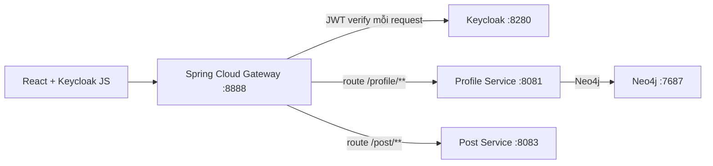
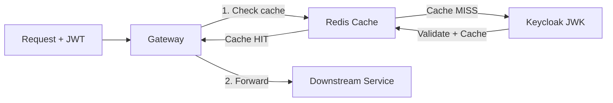
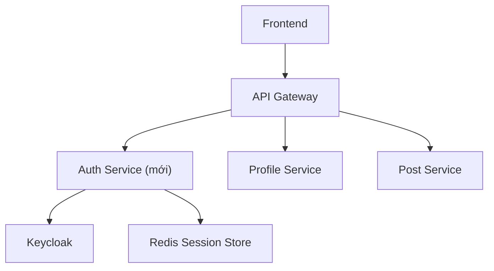
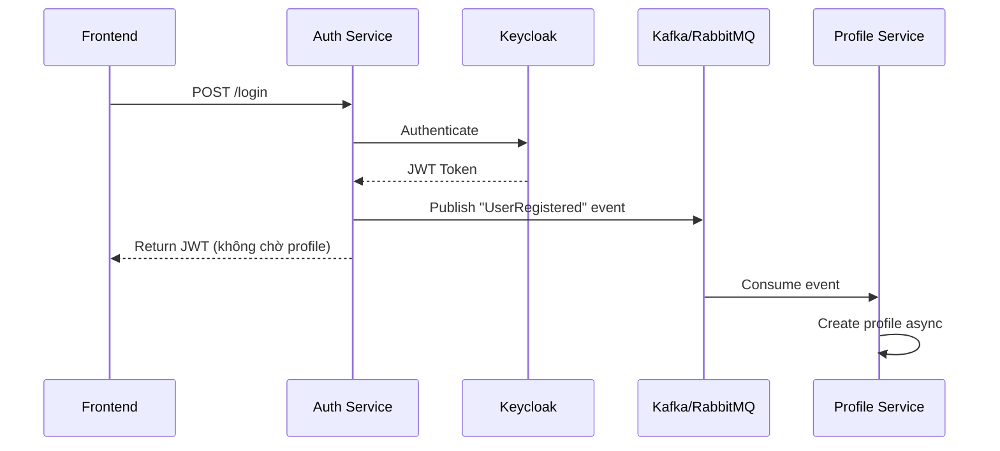

# Tối ưu Performance cho API Đăng ký / Đăng nhập — Markie

## Bối cảnh & Phân tích hiện tại

### Kiến trúc hiện tại



### Các vấn đề performance hiện tại đã phát hiện

| # | Vấn đề | File | Ảnh hưởng |
|---|--------|------|-----------|
| 1 | **Gateway gọi Keycloak `/userinfo` qua mạng** cho mỗi request xác thực — tuy hiện tại `AuthenticationFilter` chỉ check Bearer header, nhưng `IdentityClient` vẫn được cấu hình để gọi Keycloak userinfo endpoint | [IdentityClient.java](file:///d:/Máy tính/Markie/gateway/gateway/src/main/java/com/stewie/gateway/repository/httpclient/IdentityClient.java) | Network round-trip ~10-50ms mỗi request |
| 2 | **JWK Set URI được fetch mỗi lần khởi động** mà không có caching rõ ràng — Spring mặc định cache nhưng không có TTL tuning | [application.yaml](file:///d:/Máy tính/Markie/gateway/gateway/src/main/resources/application.yaml#L24) | Có thể gây delay khi cache expire |
| 3 | **Profile sync (`/users/sync-profile`)** gọi `findByUserId` → nếu chưa có thì INSERT — **không có index trên `userId`** trong Neo4j | [UserProfileRepository.java](file:///d:/Máy tính/Markie/profile/profile/src/main/java/com/stewie/profile/repository/UserProfileRepository.java) | Full scan O(n) thay vì O(log n) |
| 4 | **Không có Rate Limiting** trên các public endpoints (`/internal/registration`, `/internal/login`) | [AuthenticationFilter.java](file:///d:/Máy tính/Markie/gateway/gateway/src/main/java/com/stewie/gateway/configuration/AuthenticationFilter.java#L29-L32) | Brute-force attack, resource exhaustion |
| 5 | **Không có Connection Pool tuning** cho WebClient gọi Keycloak | [WebClientConfiguration.java](file:///d:/Máy tính/Markie/gateway/gateway/src/main/java/com/stewie/gateway/configuration/WebClientConfiguration.java) | Connection churn dưới tải cao |
| 6 | **Frontend không có token auto-refresh** — `keycloak.init()` chỉ dùng `check-sso`, không setup `onTokenExpired` hay refresh interval | [AuthContext.tsx](file:///d:/Máy tính/Markie/web-app/src/context/AuthContext.tsx) | User bị logout bất ngờ, phải đăng nhập lại |

---

## Đề xuất thay đổi

### Phase 1: Quick Wins — Tối ưu với effort thấp, impact cao

---

### 1.1 Thêm Neo4j Index cho `userId`

#### [MODIFY] [UserProfile.java](file:///d:/Máy tính/Markie/profile/profile/src/main/java/com/stewie/profile/entity/UserProfile.java)

Thêm `@CompositeIndex` hoặc `@Index` trên field `userId` để Neo4j tạo index tự động:

```diff
+import org.springframework.data.neo4j.core.schema.CompositeIndex;
+
+@Node("user_profile")
+@CompositeIndex(properties = {"userId"})
 public class UserProfile {
```

**Impact**: Query `findByUserId` giảm từ O(n) → O(1), cải thiện đáng kể thời gian sync profile khi đăng nhập.

---

### 1.2 Tối ưu WebClient Connection Pool

#### [MODIFY] [WebClientConfiguration.java](file:///d:/Máy tính/Markie/gateway/gateway/src/main/java/com/stewie/gateway/configuration/WebClientConfiguration.java)

Cấu hình Reactor Netty connection pool cho WebClient:

```java
@Bean
WebClient webClient(WebClient.Builder builder) {
    // Tuned connection pool: max 50 connections, 45s idle timeout
    HttpClient httpClient = HttpClient.create()
            .option(ChannelOption.CONNECT_TIMEOUT_MILLIS, 5000)
            .responseTimeout(Duration.ofSeconds(5));

    return builder
            .baseUrl(idpUrl)
            .clientConnector(new ReactorClientHttpConnector(httpClient))
            .build();
}
```

**Impact**: Tránh connection churn, giảm latency khi Gateway gọi Keycloak dưới tải cao.

---

### 1.3 Frontend Token Auto-Refresh

#### [MODIFY] [AuthContext.tsx](file:///d:/Máy tính/Markie/web-app/src/context/AuthContext.tsx)

Thêm logic tự động refresh token trước khi hết hạn:

```typescript
useEffect(() => {
  keycloak
    .init({ onLoad: 'check-sso', checkLoginIframe: false })
    .then((auth) => {
      setAuthenticated(auth);
      setReady(true);

      if (auth) {
        // Auto-refresh token 60s trước khi hết hạn
        setInterval(() => {
          keycloak.updateToken(60).catch(() => {
            keycloak.logout();
          });
        }, 30000); // Check mỗi 30s
      }
    })
    .catch(() => setReady(true));
}, []);
```

**Impact**: Người dùng không bị mất session đột ngột, giảm số lần phải đăng nhập lại (giảm load trên Keycloak).

---

### Phase 2: Medium Effort — Caching & Rate Limiting

---

### 2.1 Redis Cache cho JWT Validation (tùy chọn)

> [!IMPORTANT]
> Phase này yêu cầu thêm Redis infrastructure. Chỉ nên triển khai khi hệ thống có >1000 concurrent users.

#### Ý tưởng thiết kế



- Cache JWT validation result bằng token hash (SHA-256) → TTL = token exp - current time
- Tránh gọi Keycloak JWK endpoint khi có nhiều request cùng token trong thời gian ngắn
- Spring Security đã cache JWK keys, nhưng nếu cần custom validation logic thì Redis giúp thêm

---

### 2.2 Rate Limiting trên Gateway

#### [NEW] RateLimitingConfig.java (Gateway)

Thêm Spring Cloud Gateway rate limiter với Redis hoặc in-memory:

```yaml
# application.yaml - thêm rate limit cho auth endpoints
spring:
  cloud:
    gateway:
      routes:
        - id: profile-service
          uri: http://localhost:8081
          predicates:
            - Path=/profile/**
          filters:
            - name: RequestRateLimiter
              args:
                rate-limiter: "#{@customRateLimiter}"
                key-resolver: "#{@ipKeyResolver}"
```

Hoặc dùng Resilience4j Rate Limiter:

```java
@Bean
public KeyResolver ipKeyResolver() {
    return exchange -> Mono.just(
        exchange.getRequest().getRemoteAddress().getAddress().getHostAddress()
    );
}
```

**Impact**: Chống brute-force attack trên login/register, bảo vệ Keycloak và Neo4j khỏi bị quá tải.

---

### Phase 3: Advanced — Kiến trúc mới (Long-term)

---

### 3.1 Tách Auth Service riêng biệt



- **Auth Service** đóng vai trò facade cho Keycloak
- Xử lý login, register, token refresh, token revocation
- Cache session / token metadata trong Redis
- Profile Service không cần biết về Keycloak → clean separation of concerns

---

### 3.2 Event-Driven Profile Creation

Thay vì sync profile qua REST call khi user đăng nhập, sử dụng event-driven:



**Impact**: Login response time giảm ~40-60% vì không phải chờ profile sync đồng bộ.

---

## Tổng hợp Impact dự kiến

| Optimization | Latency giảm | Effort | Priority |
|---|---|---|---|
| Neo4j Index trên `userId` | -20-50ms per login | ⭐ Thấp | 🔴 Cao |
| WebClient Connection Pool | -10-30ms under load | ⭐ Thấp | 🔴 Cao |
| Frontend Token Refresh | Giảm re-login 90%+ | ⭐ Thấp | 🔴 Cao |
| Rate Limiting | Bảo vệ hệ thống | ⭐⭐ Trung bình | 🟡 Trung bình |
| Redis JWT Cache | -5-15ms per request | ⭐⭐ Trung bình | 🟡 Trung bình |
| Auth Service riêng | Kiến trúc sạch hơn | ⭐⭐⭐ Cao | 🟢 Thấp (long-term) |
| Event-Driven Profile | -40-60% login time | ⭐⭐⭐ Cao | 🟢 Thấp (long-term) |

---

## User Review Required

> [!IMPORTANT]
> **Bạn muốn triển khai phase nào?**
> - **Phase 1** (Quick Wins): Neo4j Index + WebClient tuning + Token refresh — có thể implement ngay
> - **Phase 2** (Medium): Rate Limiting + Redis Cache — cần thêm Redis dependency
> - **Phase 3** (Advanced): Tách Auth Service + Event-Driven — thay đổi kiến trúc lớn

## Open Questions

> [!IMPORTANT]
> 1. **Redis**: Hệ thống hiện tại đã có Redis chưa? Nếu chưa, bạn có muốn thêm Redis cho caching + rate limiting không?
> 2. **Message Queue**: Bạn có plan dùng Kafka/RabbitMQ không? Điều này ảnh hưởng đến Phase 3 (Event-Driven).
> 3. **Scale target**: Hệ thống dự kiến phải handle bao nhiêu concurrent users? Điều này quyết định mức độ tối ưu cần thiết.
> 4. **Keycloak token lifetime**: Token access hiện tại đặt TTL bao lâu trong Keycloak? (ảnh hưởng đến chiến lược cache).

## Verification Plan

### Automated Tests
- Unit test cho `UserProfileService.syncProfile()` với Neo4j index
- Integration test cho WebClient timeout + connection pool behavior
- Load test bằng `k6` hoặc `JMeter` trên endpoint login/register trước & sau tối ưu

### Manual Verification
- Đo response time trước và sau bằng Postman/curl
- Monitor Neo4j query performance qua Neo4j Browser
- Kiểm tra frontend token refresh qua browser DevTools → Network tab
